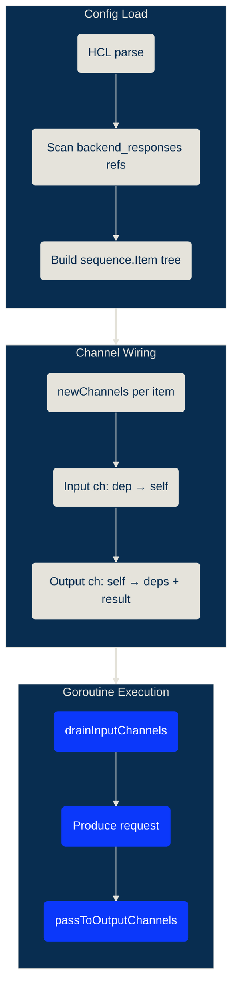
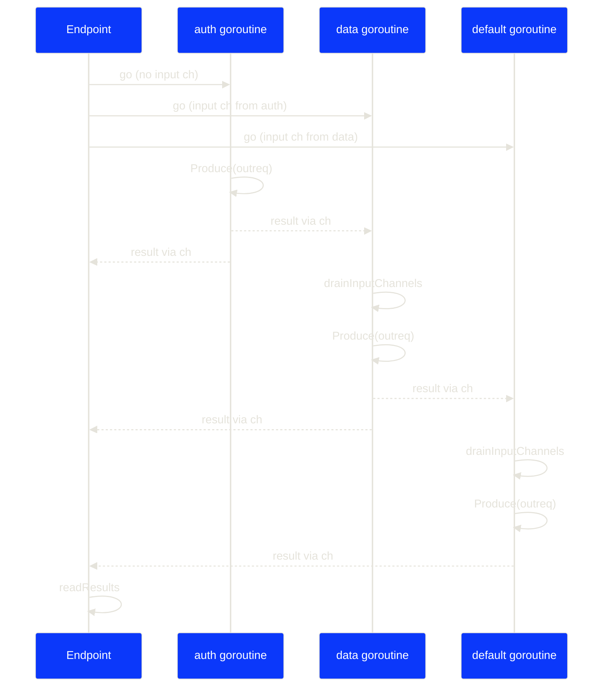

# Couper Architecture

This document describes Couper's internal architecture for contributors and AI assistants.

## Project Overview

Couper is a lightweight API gateway written in Go. It acts as a proxy connecting clients with backend services, providing access control, request/response manipulation, and observability features. Configuration is done via HCL (HashiCorp Configuration Language) files.

## Configuration Flow

1. **Config Loading** (`config/configload/`): HCL files are parsed via `LoadFiles()` in `load.go`. The parser handles environment blocks, merging multiple config files, and path resolution.

2. **Runtime Configuration** (`config/runtime/`): `NewServerConfiguration()` in `server.go` transforms parsed config into runnable server configuration, wiring up access controls, backends, and handlers.

3. **Server Startup** (`server/http.go`): `HTTPServer` manages listeners and multiplexers (`Mux`) that route requests to appropriate handlers.

## Key Packages

- **`config/`**: Configuration structs and HCL schema definitions. `couper.go` defines the root `Couper` struct with `Servers`, `Definitions`, `Settings`, and `Defaults`.

- **`config/configload/`**: HCL parsing and validation. Handles environment-specific blocks, backend definitions, and endpoint configuration.

- **`config/runtime/`**: Converts parsed config into HTTP handlers. Maps endpoints to handlers and configures access controls.

- **`handler/`**: HTTP handlers for different endpoint types:
  - `endpoint.go`: Main request handler with sequence/parallel request support
  - `proxy.go`: Reverse proxy with request/response modification
  - `file.go`, `spa.go`: Static file and SPA serving

- **`handler/transport/`**: Backend HTTP transport layer with health checks, rate limiting, and request authorization.

- **`accesscontrol/`**: Authentication/authorization implementations:
  - `ac.go`: `AccessControl` interface definition (`Validate(req *http.Request) error`)
  - `jwt.go`: JWT validation with JWKS support
  - `basic_auth.go`: Basic authentication
  - `oauth2.go`: OAuth2 callback handling
  - `saml2.go`: SAML2 SSO

- **`eval/`**: HCL expression evaluation. `Context` in `context.go` provides request/response variables and functions for HCL expressions.

- **`eval/lib/`**: Custom HCL functions (base64, JWT signing, OAuth2, SAML, URL manipulation, merge, time).

- **`errors/`**: Custom error types with hierarchical kinds for error_handler matching. Types generated from `errors/generate/types.go`.

## HCL Configuration Structure

Top-level blocks:
- `server`: HTTP server with endpoints, APIs, files, and spa blocks
- `definitions`: Reusable backends, access controls, and jobs
- `settings`: Global settings (ports, logging, timeouts)
- `defaults`: Default values including environment variables

## The Inline Interface Pattern (Core Architecture)

The Inline pattern is central to Couper's request/response processing. It separates **parse-time attributes** (decoded during config load into struct fields) from **runtime attributes** (evaluated per-request as HCL expressions).

### Key Interfaces (`config/inline.go`)

```go
type Inline interface {
    Inline() interface{}           // Returns struct defining runtime-evaluated attributes
    Schema(inline bool) *hcl.BodySchema  // Returns schema for parse-time (false) or runtime (true)
}

type Body interface {
    HCLBody() *hclsyntax.Body      // Returns raw HCL body containing unevaluated expressions
}
```

### How It Works

1. **Config structs** have two parts:
   - **Struct fields**: Parsed at config load (e.g., `Name`, `BackendName`, child blocks)
   - **`Remain hcl.Body`**: Captures unparsed HCL for runtime evaluation

2. **`Inline()` method** returns a struct defining which attributes are evaluated per-request:
   ```go
   func (e Endpoint) Inline() interface{} {
       type Inline struct {
           meta.RequestHeadersAttributes   // set_request_headers, add_request_headers, etc.
           meta.ResponseHeadersAttributes  // set_response_headers, add_response_headers, etc.
           meta.FormParamsAttributes       // set_form_params, add_form_params, etc.
           meta.QueryParamsAttributes      // set_query_params, add_query_params, etc.
           meta.LogFieldsAttribute         // custom_log_fields
           ResponseStatus *uint8 `hcl:"set_response_status,optional"`
       }
       return &Inline{}
   }
   ```

3. **`HCLBody()`** casts `Remain` to `*hclsyntax.Body` for expression evaluation

### Shared Modifier Attributes (`config/meta/attributes.go`)

Embedded in Inline structs to provide consistent request/response modification:
- `RequestHeadersAttributes`: `set_request_headers`, `add_request_headers`, `remove_request_headers`
- `ResponseHeadersAttributes`: `set_response_headers`, `add_response_headers`, `remove_response_headers`
- `QueryParamsAttributes`: `set_query_params`, `add_query_params`, `remove_query_params`
- `FormParamsAttributes`: `set_form_params`, `add_form_params`, `remove_form_params`
- `LogFieldsAttribute`: `custom_log_fields`

Attribute name constants are in `eval/attributes/attributes.go`.

### Blocks Implementing Inline

| Block | Parse-time | Runtime (Inline) |
|-------|------------|------------------|
| `Endpoint` | pattern, access_control, proxy/request blocks | headers, query/form params, response_status |
| `Proxy` | backend reference, name | headers, query/form params, url, expected_status |
| `Request` | backend reference, name | method, url, body, json_body, headers, expected_status |
| `Response` | (none) | status, body, json_body, headers |
| `Backend` | TLS, health, rate_limit configs | origin, path, headers, timeouts |
| `ErrorHandler` | kinds, proxy/request/response blocks | headers, query/form params, response_status |

### Runtime Evaluation Flow

1. **Request Phase** (`eval/http.go:ApplyRequestContext`):
   - Called on endpoint context, then proxy/request context
   - Evaluates: path, request headers (del→set→add order), query params, form params
   - Uses `eval.ContextFromRequest(req).HCLContextSync()` for current HCL context

2. **Backend Response** (`eval/context.go:WithBeresp`):
   - Creates new context with `backend_request`, `backend_response` variables
   - Merges into `backend_requests`, `backend_responses` maps for sequence access
   - Updates functions that depend on response data

3. **Response Phase** (`eval/http.go:ApplyResponseContext`):
   - Evaluates response headers (del→set→add order), response status
   - Called on proxy context during `RoundTrip()`, endpoint context before write

4. **Final Write** (`server/writer/response.go:applyModifiers`):
   - Accumulated modifier bodies applied to response headers
   - Called in `WriteHeader()` before status is written

### Sequence Dependencies (`config/sequence/`)

Backend requests can depend on each other's responses:
```hcl
endpoint "/example" {
  request "auth" { ... }
  request "data" {
    headers = { Authorization = backend_responses.auth.json_body.token }
  }
}
```

- `sequence.Item` builds dependency graph at config load
- `handler/endpoint.go:produce()` executes via channels: dependents wait for dependencies
- Each completed request updates `eval.Context` via `WithBeresp()`
- `HCLContextSync()` synchronizes variables for dependent request evaluation

### Buffer Detection (`eval/buffer/option.go`)

`buffer.Must()` statically analyzes HCL bodies to determine buffering needs:
- Scans all expressions for variable references (`request.body`, `backend_responses.*.json_body`)
- Returns `Option` flags: `Request`, `Response`, `JSONParseRequest`, `JSONParseResponse`
- Used by endpoint to pre-buffer bodies that will be accessed in expressions

## Sequence Execution

Endpoints can contain multiple `proxy` and `request` blocks. These blocks execute as a **sequence** when one block references another's response via `backend_responses.<name>`. Independent blocks run concurrently; dependent blocks wait for their dependencies to complete.

### Lifecycle Overview



### Dependency Detection (`config/sequence/`)

At config load time, HCL expressions in each `proxy`/`request` block are scanned for references to `backend_responses.<name>`. Each reference creates a dependency edge in the `sequence.Item` tree:

- `sequence.Item` stores the block name and a list of `deps` (other Items it depends on)
- `Item.Add()` registers a dependency and checks for **circular references** (panics with a diagnostic if detected)
- `Item.Deps()` returns dependencies in reversed order so they resolve first
- `sequence.Dependencies()` flattens the tree into ordered resolution lists for filtering

**Example**: Given this configuration:
```hcl
endpoint "/pipeline" {
  request "auth"  { backend = "auth_api" }
  request "data"  {
    backend = "data_api"
    headers = { Authorization = backend_responses.auth.json_body.token }
  }
  proxy "default" {
    backend = "main_api"
    url     = backend_responses.data.json_body.url
  }
}
```

The dependency tree is: `default → data → auth`.

### Channel Architecture (`handler/endpoint.go`)

`newChannels()` builds three channel maps from the `sequence.List`:

| Channel map | Key | Purpose |
|-------------|-----|---------|
| `inputChannels` | consumer name | Channels a goroutine reads from before executing (blocks until deps complete) |
| `outputChannels` | producer name | Channels a goroutine writes to after completing (unblocks dependents + result) |
| `resultChannels` | item name | One channel per item, collected by `readResults()` |

`fillChannels()` walks the dependency tree recursively. For each dependency edge `A → B`:
- Creates a buffered channel (`cap 1`)
- Adds it to `inputChannels[A]` (A reads from it)
- Adds it to `outputChannels[B]` (B writes to it)

Each item's result channel is also added to its `outputChannels`, so completing a request fans out to both dependents and the result collector.

### Execution Model

`produce()` (`handler/endpoint.go:318`) orchestrates the sequence:

1. Creates `outreq` from the incoming request context (carries the SERVER span from `TraceHandler`)
2. Calls `newChannels()` to wire up the dependency graph
3. Sorts producers so the `default` proxy runs last (`SortDefault`)
4. Launches one **goroutine per producer** with a 2ms stagger (`time.Sleep`)
5. Each goroutine:
   - Calls `drainInputChannels()` — blocks until all dependency results arrive
   - If any dependency errored, propagates the error to output channels and returns
   - Calls `rt.Produce(outreq)` — executes the actual HTTP request
   - Calls `passToOutputChannels()` — fans out the result to dependents and result channel
6. `readResults()` collects from result channels in sequence order



### Error Propagation

When a dependency fails:

1. `drainInputChannels()` receives the error result from the input channel
2. Wraps it with `errors.Sequence` kind (if not already a sequence error)
3. Calls `passToOutputChannels()` to forward the error to all downstream dependents
4. Returns `true`, causing the goroutine to exit without calling `Produce()`

This cascading propagation ensures that if `auth` fails, both `data` and `default` receive the error without attempting their HTTP requests.

### Response Selection

After `readResults()` collects all results, `Endpoint.ServeHTTP()` selects the response to send to the client:

- If a custom `response` block exists, it is evaluated with all `backend_responses` available
- Otherwise, the **`default`** proxy/request result provides the client response
- Named (non-default) results are available in HCL expressions but don't directly produce the client response

### OTel Trace Hierarchy

Each backend call within a sequence gets its own CLIENT span, all parented under the SERVER span:

```
SERVER "/pipeline"                  (TraceHandler)
  ├── CLIENT "backend.auth_api"     (auth - runs first)
  ├── CLIENT "backend.data_api"     (data - after auth)
  └── CLIENT "backend.main_api"     (default - after data)
```

The span hierarchy is created by:

1. `TraceHandler` (`handler/middleware/trace.go:57`) creates a **SERVER span** and stores it in the request context
2. `produce()` creates `outreq` from that context — all goroutines share the same parent span
3. Each producer's transport chain calls `InstrumentedRoundTripper.RoundTrip()` (`telemetry/transport.go:46`)
4. `NewSpanFromContext(ctx, spanName)` creates a **CLIENT span** parented under the SERVER span
5. `otel.GetTextMapPropagator().Inject()` writes the `traceparent` header so downstream services see the correct parent

All CLIENT spans are **siblings** under the SERVER span — they are not nested under each other, even in a sequential dependency chain. This correctly represents that the gateway is the parent of each backend call.

## HCL Evaluation Context

### Available Functions

Defined in `eval/context.go:newFunctionsMap()`:
- `base64_decode`, `base64_encode`
- `coalesce`, `default` (return first non-null/non-empty value)
- `contains`, `join`, `split`, `keys`, `length`, `lookup`
- `json_decode`, `json_encode`
- `merge` (deep merge objects)
- `relative_url`, `url_decode`, `url_encode`
- `to_lower`, `to_upper`, `trim`, `substr`
- `unixtime`
- `jwt_sign` (when JWT signing profile configured)
- `oauth_authorization_url`, `oauth_verifier` (when OAuth2 configured)
- `saml_sso_url` (when SAML configured)

### Available Variables

Defined in `eval/variables/variables.go`:
- `request`: Client request (method, path, headers, query, body, cookies, etc.)
- `backend_requests`, `backend_responses`: Upstream request/response data
- `env`: Environment variables
- `couper`: Couper metadata (version, environment)

## Error Type System

Errors use a hierarchical kind system for `error_handler` blocks. Base types in `errors/couper.go`:
- `AccessControl`, `Backend`, `Endpoint`, `Evaluation`, `Configuration`
- `ClientRequest`, `RouteNotFound`, `MethodNotAllowed`, `Server`

Specific error types are generated via `go generate` from `errors/error.go:Definitions`. The `Contexts` field determines which blocks can catch an error type.

## Request Processing Pipeline

1. `server.Mux` routes request to handler based on path/host
2. Access controls validate (JWT, Basic Auth, OAuth2, etc.)
3. `handler.Endpoint` orchestrates request/response:
   - Evaluates HCL expressions for request modification
   - Executes `request`/`proxy` blocks (parallel or sequenced via `config/sequence/`)
   - `handler/producer/` creates outgoing requests
   - `handler/transport/Backend` handles HTTP transport with rate limits, health checks
4. Response modification and client response

## Documentation Generation

Documentation at https://docs.couper.io is generated from struct tags. Run `make generate-docs` to update.

### Struct Tag Conventions

Config structs in `config/` use these tags for documentation generation:

```go
type Example struct {
    Field string `hcl:"field_name,optional" docs:"Description with {inline_code}." type:"duration" default:"10s"`
}
```

- `hcl:"name,optional"` or `hcl:"name,block"`: HCL attribute/block name
- `docs:"..."`: Description for documentation (curly braces `{code}` become backticks)
- `type:"..."`: Override inferred type (e.g., `duration`, `string or object`)
- `default:"..."`: Default value shown in docs

## Custom HCL/Cty Libraries

The project uses forked versions of `hashicorp/hcl/v2` and `zclconf/go-cty` (see `go.mod` replace directives) with custom modifications.

## Improvement Notes

### Inline Pattern Complexity

**Current State**: The Inline pattern conflates multiple concerns:
1. Config definition (what attributes exist)
2. Documentation generation (struct tags)
3. Runtime behavior specification (which attributes are evaluated when)
4. Schema generation for HCL parsing

**Observations**:
- Same struct serves documentation generator (`config/generate/main.go`) and runtime evaluation
- `Inline()` returns anonymous structs, making the runtime contract implicit
- The `Remain hcl.Body` + `HCLBody()` pattern is repeated across all config types
- Modifier application is spread across `eval/http.go`, `handler/proxy.go`, and `server/writer/response.go`

**Potential Improvements**:
1. **Explicit Behavior Types**: Separate `EndpointConfig` (parse-time) from `EndpointBehavior` (runtime contract)
2. **Base Type for Body Handling**: Extract `Remain`/`HCLBody()` into embedded base type
3. **Centralized Modifier Pipeline**: Single modifier application point with clear ordering guarantees
4. **Typed Inline Attributes**: Replace anonymous struct in `Inline()` with named type for better tooling

### Buffer Detection via Static Analysis

**Current State**: `buffer.Must()` uses reflection to traverse HCL expressions:
- Walks `traversal.RootName()` and field names via reflection
- Fragile to variable naming changes
- Complex switch statements for each variable type

**Potential Improvements**:
1. **Explicit Buffer Requirements**: Config blocks declare what they need
2. **Compile-Time Validation**: Catch missing buffer requirements during config load
3. **Lazy Evaluation**: Buffer on first access rather than pre-determining

### Context Cloning and Threading

**Current State**: `eval.Context` is cloned on mutations:
- `clone()` creates new context with copied maps
- `WithBeresp()` creates context for each backend response
- `HCLContextSync()` synchronizes variables from `syncedVariables`

**Observations**:
- Multiple context instances during single request lifecycle
- Unclear which context is "current" at any point
- `syncedVariables` adds another layer of indirection

**Potential Improvements**:
1. **Immutable Context with Builder**: Explicit context creation points
2. **Request-Scoped State Container**: Single mutable state object per request
3. **Clear Lifecycle Documentation**: Document when/why contexts are cloned
