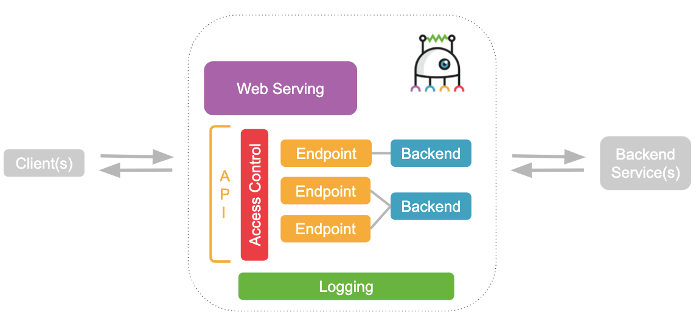
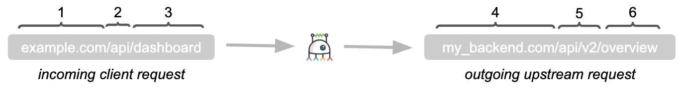

# Couper Docs - Version 1.1

## Table of contents

* [Introduction](#introduction)
* [Core concepts](#core-concepts)
* [Command line interface](#command-line-interface)
  * [Global options](#global-options)
* [Configuration file](#configuration-file)
  * [Syntax](#syntax)
  * [File name](#file-name)
  * [Basic file structure](#basic-file-structure)
    * [Nesting of configuration blocks and attributes](#nesting-of-configuration-blocks-and-attributes)
  * [Variables](#variables)
    * [`env`](#env-variable)
    * [`request`](#request-client-request-variable)
    * [`backend_requests`](#backend_requests-modified-backend-requests-variables)
    * [`backend_responses`](#backend_responses-non-modified-backend-responses-variables)
    * [Variable example](#variable-example)
  * [Expressions](#expressions)
  * [Functions](#functions)
* [Reference](#reference)
  * [Server Block](#server-block)
    * [Files Block](#files-block)
    * [SPA Block](#spa-block)
    * [API Block](#api-block)
    * [Endpoint Block](#endpoint-block)
    * [Backend Block](#backend-block)
      * [OpenAPI Block](#openapi-block)
      * [OAuth2 Block](#oauth2-block)
      * [Transport Settings Attributes](#transport-settings-attributes)
    * [CORS Block](#cors-block)
    * [Access Control](#access-control)
  * [Modifier](#modifier)
    * [Query Parameter](#query-parameter)
    * [Request Header](#request-header)
    * [Response Header](#response-header)
  * [Path parameter](#path-parameter)
  * [Definitions Block](#definitions-block)
    * [Basic Auth Block](#basic-auth-block)
    * [JWT Block](#jwt-block)
    * [JWT Signing Profile Block](#jwt-signing-profile-block)
    * [SAML Block](#saml-block)
  * [Settings Block](#settings-block)
  * [Health-Check](#health-check)
* [Examples](#examples)
  * [Request routing](#request-routing-example)
  * [Routing configuration](#routing-configuration-example)
  * [Web serving configuration](#web-serving-configuration-example)
  * [`access_control` configuration](#access_control-configuration-example)
  * [`hosts` configuration](#hosts-configuration-example)
  * [Referencing and overwriting](#referencing-and-overwriting-example)

## Introduction

Couper is a lightweight open source API gateway designed to support developers in
building and running API-driven Web projects. Acting as a proxy component it connects
clients with (micro) services and adds access control and observability to the project.
Couper does not need any special development skills and offers easy configuration
and integration.

## Core concepts



| Concept / Feature  | Description |
|:-------------------|:------------|
| Client(s)          | Browser, App or API Client that sends requests to Couper. |
| Web Serving        | Couper supports file serving and Web serving for SPA assets. |
| API                | Configuration block that bundles endpoints under a certain base path. |
| Access Control     | Couper handles access control for incoming client requests and outgoing backend requests. |
| Endpoint           | Configuration block that specifies how (and if) requests are sent to backend service(s) after they reach Couper. |
| Backend            | Configuration block that specifies the connection to a local/remote backend service. |
| Logging            | Couper provides standard logs for analysis and monitoring. |
| Backend Service(s) | External API or micro services where Couper fetches data from. |
| Validation         | Couper supports validation of outgoing and incoming requests to and from the origin. |

## Command Line Interface

Couper is build as binary called `couper` with the following commands:

| Command   | Description                                       |
|:----------|:--------------------------------------------------|
| `run`     | Start the server with given configuration file.   |
|           | *Note*: `run` options can also be configured with [settings](#settings-block) or related [environment variables](./../DOCKER.md).
| `help`    | Print the usage for the given command: `help run` |
| `version` | Print the current version and build information.  |

### Global Options

| Argument  | Default      | Environment       | Description                                                       |
|:----------|:-------------|:------------------|:------------------------------------------------------------------|
| `-f`      | `couper.hcl` | `COUPER_FILE`     | File path to your Couper configuration file.                      |
| `-watch`  | `false`      | `COUPER_WATCH`    | Watch for configuration file changes and reload on modifications. |
| `-watch-retries`  | `5`  | `COUPER_WATCH_RETRIES` | Maximal retry count for configuration reloads which could not bind the configured port. |
| `-watch-retry-delay`  | `500ms`  | `COUPER_WATCH_RETRY_DELAY` | Delay duration before next attempt if an error occurs. |
| `-log-format`  | `common` | `COUPER_LOG_FORMAT` | Can be set to `json` output format. |
| `-log-pretty`  | `false` | `COUPER_LOG_PRETTY`  | Option for `json` log format which pretty prints with basic key coloring. |

*Note*: `log-format` and `log-pretty` also maps to [settings](#settings-block).

## Configuration file

### Syntax

The syntax for Couper's configuration file is
[HCL 2.0](https://github.com/hashicorp/hcl/tree/hcl2#information-model-and-syntax),
a configuration language by HashiCorp.

### File name

The file-ending of your configuration file should be .hcl to have syntax highlighting
within your IDE.

The file name defaults to `couper.hcl` in your working directory. This can be
changed with the `-f` command-line flag. With `-f /opt/couper/my_conf.hcl` couper
changes the working directory to `/opt/couper` and loads `my_conf.hcl`.

### Basic file structure

Couper's configuration file consists of nested configuration blocks that configure
Web serving and routing of the gateway. Access control is controlled by an
[Access Control](#access-control) attribute that can be set for many blocks.

For orientation compare the following example and the information below:

```hcl
server "my_project" {
  files { 
    # ...
  }

  spa {
    # ...
  }

  api {
    access_control = ["foo"]
    endpoint "/bar" {
      proxy {
        backend { }
      }
      request "sub-request" {
        backend { }
      }
      response { }
    }
  }
}

definitions {
  # ...
}

settings {
  # ...
}
```

* `server` main configuration block(s)
  * `files` configuration block for file serving
  * `spa` configuration block for Web serving (SPA assets)
  * `api` configuration block(s) that bundles endpoints under a certain base path or `access_control` list
  * `access_control` attribute that sets access control for a block context
  * `endpoint` configuration block for Couper's entry points
    * `proxy` configuration block for a proxy request and response to an origin
    * `request` configuration block for a manual request to an origin
    * `response` configuration block for a manual client response
    * `backend` configuration block for connection to local/remote backend service(s)
* `definitions` block for predefined configurations, that can be referenced
* `settings` block for server configuration which applies to the running instance

#### Nesting of configuration blocks and attributes

* [Server Block(s)](#server-block)
  * [Access Control](#access-control)
  * [Endpoint Block(s)](#endpoint-block)
    * [Access Control](#access-control)
    * [Proxy Block(s)](#proxy-block)
      * [Backend Block](#backend-block) or [Backend Block Reference](#backend-block-reference)
    * [Request Block(s)](#request-block)
      * [Backend Block](#backend-block) or [Backend Block Reference](#backend-block-reference)
    * [Response Block](#response-block)
    * [Modifier](#modifier)
  * [Files Block](#files-block)
    * [Access Control](#access-control)
  * [SPA Block](#spa-block)
    * [Access Control](#access-control)
  * [API Block](#api-block)
    * [Access Control](#access-control)
    * [Endpoint Block(s)](#endpoint-block)
      * [Access Control](#access-control)
      * [Proxy Block(s)](#proxy-block)
        * [Backend Block](#backend-block) or [Backend Block Reference](#backend-block-reference)
        * [Modifier](#modifier)
      * [Request Block(s)](#request-block)
        * [Backend Block](#backend-block) or [Backend Block Reference](#backend-block-reference)
      * [Response Block](#response-block)
      * [Modifier](#modifier)
* [Definitions Block](#definitions-block)
  * [Backend Block](#backend-block)
  * [JWT Block(s)](#jwt-block)
  * [JWT Signing Profile Block(s)](#jwt-signing-profile-block)
  * [Basic Auth Block(s)](#basic-auth-block)
  * [SAML Block(s)](#saml-block)
* [Settings Block](#settings-block)

### Variables

The configuration file allows the use of some predefined variables. There are
two phases when those variables get evaluated. The first phase is at config load
which is currently related to `env` and **function** usage. The second evaluation
will happen during the request/response handling.

* `env` are the environment variables
* `request` is the client request
* `backend_requests` contains all modified backend requests
* `backend_responses` contains all original backend responses

Most fields are self-explanatory (compare tables below).

#### `env` variable

Environment variables can be accessed everywhere within the configuration file
since these references get evaluated at start.

#### `request` (client request) variable

| Variable                  | Description |
|:--------------------------|:------------|
| `id`                      | Unique request id |
| `method`                  | HTTP method |
| `path`                    | URL path |
| `endpoint`                | Matched endpoint pattern |
| `headers.<name>`          | HTTP request header value for requested lower-case key |
| `cookies.<name>`          | Value from `Cookie` request header for requested key (&#9888; last wins!) |
| `query.<name>`            | Query parameter values (&#9888; last wins!) |
| `path_params.<name>`      | Value from a named path parameter defined within an endpoint path label |
| `body`                    | The request message body |
| `form_body.<name>`        | Parameter in a `application/x-www-form-urlencoded` body |
| `json_body.<name>`        | Access json decoded object properties. Media type must be `application/json` or `application/*+json`. |
| `context.<name>.<property_name>` | Request context containing claims from JWT used for [Access Control](#access-control) or information from a SAML assertion, `<name>` being the [JWT Block's](#jwt-block) or [SAML Block's](#saml-block) label and `property_name` being the claim's or assertion information's name |

#### `backend_requests` (modified backend requests) variables

`backend_requests.<label>` is a list of all backend requests, and their variables.
To access a specific request use the related label. [Request](#request-block) and
[Proxy](#proxy-block) blocks without a label will be available as `default`.
To access the HTTP method of the `default` request use `backend_requests.default.method` .

| Variable                  | Description |
|:--------------------------|:------------|
| `id`                      | Unique request id |
| `method`                  | HTTP method |
| `path`                    | URL path |
| `headers.<name>`          | HTTP request header value for requested lower-case key |
| `cookies.<name>`          | Value from `Cookie` request header for requested key (&#9888; last wins!) |
| `query.<name>`            | Query parameter values (&#9888; last wins!) |
| `form_body.<name>`        | Parameter in a `application/x-www-form-urlencoded` body |
| `context.<name>.<property_name>` | Request context containing claims from JWT used for [Access Control](#access-control) or information from a SAML assertion, `<name>` being the [JWT Block's](#jwt-block) or [SAML Block's](#saml-block) label and `property_name` being the claim's or assertion information's name |
| `url`                     | Backend origin URL |

#### `backend_responses` (non modified backend responses) variables

`backend_responses.<label>` is a list of all backend responses, and their variables. Same behaviour as for `backend_requests`.
Use the related label to access a specific response.
[Request](#request-block) and [Proxy](#proxy-block) blocks without a label will be available as `default`.
To access the HTTP status code of the `default` response use `backend_responses.default.status` .

| Variable           | Description |
|:-------------------|:------------|
| `status`           | HTTP status code |
| `headers.<name>`   | HTTP response header value for requested lower-case key |
| `cookies.<name>`   | Value from `Set-Cookie` response header for requested key (&#9888; last wins!) |
| `body`             | The response message body |
| `json_body.<name>` | Access json decoded object properties. Media type must be `application/json` or `application/*+json`. |

##### Variable Example

An example to send an additional header with client request header to a configured
backend and gets evaluated on per request basis:

```hcl
server "variables-srv" {
  api {
    endpoint "/" {
      proxy {
        backend "my_backend_definition" {
          set_request_headers = {
            x-env-user = env.USER
            user-agent = "myproxyClient/${request.headers.app-version}"
            x-uuid = request.id
          }
        }
      }
    }
  }
}
```

### Expressions

Since we use HCL2 for our configuration, we are able to use attribute values as
expression:

```hcl
// Arithmetic with literals and application-provided variables
sum = 1 + addend

// String interpolation and templates
message = "Hello, ${name}!"

// Application-provided functions
shouty_message = upper(message)
```

### Functions

Functions are little helper methods which are registered for every hcl evaluation
context.

| Name               | Description |
|:-------------------|:------------|
| `base64_decode`    | Decodes Base64 data, as specified in RFC 4648. |
| `base64_encode`    | Encodes Base64 data, as specified in RFC 4648. |
| `coalesce`         | Returns the first of the given arguments that is not null. |
| `json_decode`      | Parses the given JSON string and, if it is valid, returns the value it represents. |
| `json_encode`      | Returns a JSON serialization of the given value. |
| `jwt_sign`         | jwt_sign creates and signs a JSON Web Token (JWT) from information from a referenced [JWT Signing Profile Block](#jwt-signing-profile-block) and additional claims provided as a function parameter. |
| `merge`            | Deep-merges two or more of either objects or tuples. `null` arguments are ignored. A `null` attribute value in an object removes the previous attribute value. An attribute value with a different type than the current value is set as the new value. `merge()` with no parameters returns `null`. |
| `saml_sso_url`     | Creates a SAML SingleSignOn URL (including the `SAMLRequest` parameter) from a referenced [SAML Block](#saml-block). |
| `to_lower`         | Converts a given string to lowercase. |
| `to_upper`         | Converts a given string to uppercase. |
| `unixtime`         | Retrieves the current UNIX timestamp in seconds. |
| `url_encode`       | URL-encodes a given string according to RFC 3986. |

Example usage:

```hcl
my_attribute = base64_decode("aGVsbG8gd29ybGQK")

iat = unixtime()

my_json = json_encode({
  value-a: backend_responses.default.json_body.origin
  value-b: ["item1", "item2"]
})

x = merge({"k1": 1}, null, {"k2": 2})          // -> {"k1": 1, "k2": 2}        merge object attributes
x = merge({"k": [1]}, {"k": [2]})              // -> {"k": [1, 2]}             merge tuple values
x = merge({"k": {"k1": 1}}, {"k": {"k2": 2}})  // -> {"k": {"k1": 1, "k2": 2}} merge object attributes
x = merge({"k": [1]}, {"k": null}, {"k": [2]}) // -> {"k": [2]}                remove value and set new value
x = merge({"k": [1]}, {"k": 2})                // -> {"k": 2}                  set new value
x = merge([1], null, [2, "3"], [true, false])  // -> [1, 2, "3", true, false]  merge tuple values

x = merge({"k1": 1}, 2)                        // -> error: cannot mix object with primitive value
x = merge({"k1": 1}, [2])                      // -> error: cannot mix object with tuple
x = merge([1], 2)                              // -> error: cannot mix tuple with primitive value

token = jwt_sign("MyJwt", {"sub": "abc12345"})

url = saml_sso_url("MySaml")

definitions {
  jwt_signing_profile "MyJwt" {
    signature_algorithm = "RS256"
    key_file = "priv_key.pem"
    ttl = "1h"
    claims = {
      iss = "The_Issuer"
    }
  }
  saml "MySaml" {
    idp_metadata_file = "idp-metadata.xml"
    sp_acs_url = "https://the-sp.com/api/saml/acs"
    sp_entity_id = "the-sp-entity-id"
    array_attributes = ["memberOf"]
  }
}
```

## Reference

### Server Block

The `server` block is the main configuration block of Couper's configuration file.

| Block                                | Description |
|:-------------------------------------|:------------|
| *context*                            | Root of the configuration file. |
| *label*                              | &#9888; Mandatory. |
| **Nested blocks**                    | **Description** |
| [CORS Block](#cors-block)            | Configures CORS behavior for [Files Block](#files-block), [SPA Block](#spa-block) and [API Block(s)](#api-block) contexts. |
| [Files Block](#files-block)          | Configures the file serving. |
| [SPA Block](#spa-block)              | Configures the Web serving for SPA assets. |
| [API Block(s)](#api-block)           | Configures routing and communication with backend(s). |
| [Endpoint Block(s)](#endpoint-block) | Configures specific endpoint(s) for current `Server Block` context. |
| **Attributes**                       | **Description** |
| `base_path`                          | <ul><li>Optional.</li><li>Configures the path prefix for all requests.</li><li>*Example:* `base_path = "/api"`</li><li>&#9888; Inherited by nested blocks.</li></ul> |
| `hosts`                              | <ul><li>List.</li><li>&#9888; Mandatory, if there is more than one `Server Block`.</li><li>*Example:* `hosts = ["example.com", "..."]`</li><li>You can add a specific port to your host.</li><li>*Example:* `hosts = ["localhost:9090"]`</li><li>Default port is `8080`.</li><li>Only **one** `hosts` attribute per `Server Block` is allowed.</li><li>Compare the hosts [example](#hosts-configuration-example) for details.</li></ul> |
| `error_file`                         | <ul><li>Optional.</li><li>Location of the error file template.</li><li>*Example:* `error_file = "./my_error_page.html"`</li></ul> |
| `access_control`                     | <ul><li>Optional.</li><li>Sets predefined [Access Control](#access-control) for current `Server Block` context.</li><li>*Example:* `access_control = ["foo"]`</li><li>&#9888; Inherited by nested blocks.</li></ul> |

### Files Block

The `files` block configures the file serving.

| Block                     | Description |
|:--------------------------|:------------|
| *context*                 | [Server Block](#server-block). |
| *label*                   | Not implemented. |
| **Nested blocks**         | **Description** |
| [CORS Block](#cors-block) | Configures CORS behavior for the current `Files Block` context. Overrides the CORS behavior of the parent [Server Block](#server-block). |
| **Attributes**            | **Description** |
| `base_path`               | <ul><li>Optional.</li><li>Configures the path prefix for all requests.</li><li>*Example:* `base_path = "/files"`</li></ul> |
| `document_root`           | <ul><li>&#9888; Mandatory.</li><li>Location of the document root.</li><li>*Example:* `document_root = "./htdocs"`</li></ul> |
| `error_file`              | <ul><li>Optional.</li><li>Location of the error file template.</li><li>*Example:* `error_file = "./my_error_page.html"`</li></ul> |
| `access_control`          | <ul><li>Optional.</li><li>Sets predefined [Access Control](#access-control) for current `Files Block` context.</li><li>*Example:* `access_control = ["foo"]`</li></ul>  |

### SPA Block

The `spa` block configures the Web serving for SPA assets.

| Block                     | Description |
|:--------------------------|:------------|
| *context*                 | [Server Block](#server-block). |
| *label*                   | Not implemented. |
| **Nested blocks**         | **Description** |
| [CORS Block](#cors-block) | Configures CORS behavior for the current `SPA Block` context. Overrides the CORS behavior of the parent [Server Block](#server-block). |
| **Attributes**            | **Description** |
| `base_path`               | <ul><li>Optional.</li><li>Configures the path prefix for all requests.</li><li>*Example:* `base_path = "/assets"`</li></ul> |
| `bootstrap_file`          | <ul><li>&#9888; Mandatory.</li><li>Location of the bootstrap file.</li><li>*Example:* `bootstrap_file = "./htdocs/index.html"`</li></ul>|
| `paths`                   | <ul><li>&#9888; Mandatory.</li><li>List of SPA paths that need the bootstrap file.</li><li>*Example:* `paths = ["/app/**"]`</li></ul> |
| `access_control`          | <ul><li>Optional.</li><li>Sets predefined [Access Control](#access-control) for current `SPA Block` context.</li><li>*Example:* `access_control = ["foo"]`</li></ul> |

### API Block

The `api` block contains all information about endpoints, and the connection to
remote/local backend service(s), configured in the nested
[Endpoint Block(s)](#endpoint-block). You can add more than one `api` block to a
`Server Block`. If an error occurred for api endpoints the response gets processed
as json error with an error body payload. This can be customized via `error_file`.

| Block                                | Description |
|:-------------------------------------|:------------|
| *context*                            | [Server Block](#server-block). |
| *label*                              | Optional. |
| **Nested blocks**                    | **Description** |
| [Endpoint Block(s)](#endpoint-block) | Configures specific endpoint(s) for current `API Block` context. |
| [CORS Block](#cors-block)            | Configures CORS behavior for the current `API Block` context. Overrides the CORS behavior of the parent [Server Block](#server-block). |
| **Attributes**                       | **Description** |
| `base_path`                          | <ul><li>Optional.</li><li>Configures the path prefix for all requests.</li><li>Must be unique if multiple API Blocks are defined.</li><li>*Example:* `base_path = "/v1"`</li></ul> |
| `error_file`                         | <ul><li>Optional.</li><li>Location of the error file template.</li><li>*Example:* `error_file = "./my_error_body.json"`</li></ul> |
| `access_control`                     | <ul><li>Optional.</li><li>Sets predefined [Access Control](#access-control) for current `API Block` context.</li><li>*Example:* `access_control = ["foo"]`</li><li>&#9888; Inherited by nested blocks.</li></ul> |

### Endpoint Block

The `endpoint` blocks define the entry points of Couper. The mandatory *label*
defines the path suffix for the incoming client request. The `path` attribute
changes the path for the outgoing request (compare
[request routing example](#request-routing-example)). Each `Endpoint Block` must
produce an explicit or implicit client response.

| Block                              | Description |
|:-----------------------------------|:------------|
| *context*                          | [Server Block](#server-block), [API Block](#api-block) |
| *label*                            | <ul><li>&#9888; Mandatory.</li><li>Defines the path suffix for incoming client requests.</li><li>*Example:* `endpoint "/dashboard" {...}`</li><li>Incoming client request: `http://example.com/api/v1/dashboard`</li><li>See [Path Parameter](#path-parameter), too.</ul> |
| **Nested blocks**                  | **Description** |
| [Proxy Block(s)](#proxy-block)     |  |
| [Request Block(s)](#request-block) |  |
| [Response Block](#response-block)  |  |
| **Attributes**                     | **Description** |
| `request_body_limit`               | <ul><li>Optional.</li><li>Configures the maximum buffer size while accessing `request.form_body` or `request.json_body` content.</li><li>Valid units are: `KiB, MiB, GiB`.</li><li>Default limit is `64MiB`.</li></ul> |
| `path`                             | <ul><li>Optional.</li><li>Changeable part of the upstream URL.</li><li>Changes the path suffix of the outgoing request.</li></ul> |
| `access_control`                   | <ul><li>Optional.</li><li>Sets predefined [Access Control](#access-control) for current `Endpoint Block` context.</li><li>*Example:* `access_control = ["foo"]`</li></ul> |
| [Modifier](#modifier)              | <ul><li>Optional.</li><li>All [Modifier](#modifier).</li></ul> |

### Proxy Block

The `proxy` block creates and executes a proxy request to a backend service.

&#9888; Multiple `proxy` and `request` blocks are executed in parallel.

| Block                                               | Description |
|:----------------------------------------------------|:------------|
| *context*                                           | [Endpoint Block](#endpoint-block). |
| *label*                                             | <ul><li>Partly optional.</li><li>A `Proxy Block` or [Request Block](#request-block) w/o a label has an implicit label `"default"`.</li><li>Only **one** `Proxy Block` or [Request Block](#request-block) w/ label `"default"` per [Endpoint Block](#endpoint-block) is allowed.</li></ul> |
| **Nested blocks**                                   | **Description** |
| [Backend Block](#backend-block)                     | <ul><li>&#9888; Mandatory if no [Backend Block Reference](#backend-block-reference) is defined.</li><li>Configures the connection to a local/remote backend service.</li></ul> |
| **Attributes**                                      | **Description** |
| [Backend Block Reference](#backend-block-reference) | <ul><li>&#9888; Mandatory if no [Backend Block](#backend-block) is defined.</li><li>References or refines a [Backend Block](#backend-block).</li></ul> |
| `url`                                               | <ul><li>Optional.</li><li>If defined, the host part of the URL must be the same as the `origin` attribute of the used [Backend Block](#backend-block) or [Backend Block Reference](#backend-block-reference) (if defined).</li></ul> |
| [Modifier](#modifier)                               | <ul><li>Optional.</li><li>All [Modifier](#modifier).</li></ul> |

### Request Block

The `request` block creates and executes a request to a backend service.

&#9888; Multiple `proxy` and `request` blocks are executed in parallel.

| Block                                               | Description |
|:----------------------------------------------------|:------------|
| *context*                                           | [Endpoint Block](#endpoint-block). |
| *label*                                             | <ul><li>Partly optional.</li><li>A [Proxy Block](#proxy-block) or `Request Block` w/o a label has an implicit label `"default"`.</li><li>Only **one** [Proxy Block](#proxy-block) or `Request Block` w/ label `"default"` per [Endpoint Block](#endpoint-block) is allowed.</li></ul> |
| **Nested blocks**                                   | **Description** |
| [Backend Block](#backend-block)                     | <ul><li>&#9888; Mandatory if no [Backend Block Reference](#backend-block-reference) is defined.</li><li>Configures the connection to a local/remote backend service.</li></ul> |
| **Attributes**                                      | **Description** |
| [Backend Block Reference](#backend-block-reference) | <ul><li>&#9888; Mandatory if no [Backend Block](#backend-block) is defined.</li><li>References or refines a [Backend Block](#backend-block).</li></ul> |
| `url`                                               | <ul><li>Optional.</li><li>If defined, the host part of the URL must be the same as the `origin` attribute of the used [Backend Block](#backend-block) or [Backend Block Reference](#backend-block-reference) (if defined).</li></ul> |
| `body`                                              | <ul><li>String.</li><li>Optional. Creates implicit default `Content-Type: text/plain` header field.</li></ul> |
| `json_body`                                         | <ul><li>null, Boolean, Number, String, Object, or Tuple.</li><li>Optional. Creates implicit default `Content-Type: application/json` header field.</li></ul> |
| `form_body`                                         | <ul><li>Object.</li><li>Optional. Creates implicit default `Content-Type: application/x-www-form-urlencoded` header field.</li></ul> |
| `method`                                            | <ul><li>String.</li><li>Optional.</li><li>Default `GET`.</li></ul> |
| `headers`                                           | <ul><li>Optional.</li><li>Same as `set_request_headers` in [Request Header](#request-header).</li></ul> |
| `query_params`                                      | <ul><li>Optional.</li><li>Same as `set_query_params` in [Query Parameter](#query-parameter).</li></ul> |

### Response Block

The `response` block creates and sends a client response.

| Block          | Description |
|:---------------|:------------|
| *context*      | [Endpoint Block](#endpoint-block). |
| *label*        | Not implemented. |
| **Attributes** | **Description** |
| `body`         | <ul><li>String.</li><li>Optional. Creates implicit default `Content-Type: text/plain` header field.</li></ul> |
| `json_body`    | <ul><li>null, Boolean, Number, String, Object, or Tuple.</li><li>Optional. Creates implicit default `Content-Type: application/json` header field.</li></ul> |
| `status`       | <ul><li>HTTP status code.</li><li>Optional.</li><li>Default `200`.</li></ul> |
| `headers`      | <ul><li>Optional.</li><li>Same as `set_response_headers` in [Request Header](#response-header).</li></ul> |

### Backend Block

A `backend` defines the connection to a local/remote backend service. Backends
can be defined in the [Definitions Block](#definitions-block) and use the *label*
as reference.

| Block                           | Description |
|:--------------------------------|:------------|
| *context*                       | [Definitions Block](#definitions-block), [Proxy Block](#proxy-block), [Request Block](#request-block). |
| *label*                         | &#9888; Mandatory in the [Definitions Block](#definitions-block). |
| **Nested blocks**               | **Description** |
| [OpenAPI Block](#openapi-block) | <ul><li>Optional.</li><li>Definition for validating outgoing requests to the origin and incoming responses from the origin.</li></ul> |
| [OAuth2 Block](#oauth2-block)   | <ul><li>Optional.</li><li>OAuth2 configuration block.</li></ul>
| **Attributes**                  | **Description** |
| `basic_auth`                    | <ul><li>Optional.</li><li>Basic auth for the upstream request in format `username:password`.</li></ul> |
| `hostname`                      | <ul><li>Optional.</li><li>Value of the HTTP host header field for the origin request. Since `hostname` replaces the request host the value will also be used for a server identity check during a TLS handshake with the origin.</li></ul> |
| `origin`                        | <ul><li>&#9888; Mandatory.</li><li>URL to connect to for backend requests.</li><li>&#9888; Must start with the scheme `http://...`.</li></ul> |
| `path`                          | <ul><li>Optional.</li><li>Changeable part of upstream URL.</li></ul> |
| `path_prefix`                   | <ul><li>Optional.</li><li>Prefixes all backend request paths with the given prefix.</li><li>Relative prefixes are prefixed with a slash `/`.</li></ul>
| [Modifier](#modifier)           | <ul><li>Optional.</li><li>All [Modifier](#modifier).</li></ul> |

#### Transport Settings Attributes

| Name                             | Type               | Default         | Description |
|:---------------------------------|:-------------------|:----------------|:------------|
| `connect_timeout`                | [Timing](#timings) | `10s`           | The total timeout for dialing and connect to the origin. |
| `disable_certificate_validation` | bool               | `false`         | Disables the peer certificate validation. |
| `disable_connection_reuse`       | bool               | `false`         | Disables reusage of connections to the origin. |
| `http2`                          | bool               | `false`         | Enables the HTTP2 support. |
| `max_connections`                | int                | `0` (unlimited) | The maximum number of concurrent connections in any state (*active* or *idle*) to the origin. |
| `proxy`                          | string             | (no default)    | A proxy URL for the related origin request. Example: `http://SERVER-IP_OR_NAME:PORT`. |
| `timeout`                        | [Timing](#timings) | `300s`          | The total deadline duration a backend request has for write and read/pipe. |
| `ttfb_timeout`                   | [Timing](#timings) | `60s`           | The duration from writing the full request to the origin and receiving the answer. |

### Timings

| Valid time unit | Description  |
|:----------------|:-------------|
| `ns`            | nanoseconds  |
| `us` (or `µs`)  | microseconds |
| `ms`            | milliseconds |
| `s`             | seconds      |
| `m`             | minutes      |
| `h`             | hours        |

### Backend Block Reference

A [Backend Block](#backend-block) can be used as reference of a `backend` block
from the [Definitions Block](#definitions-block). In addition, a `backend` block
from the [Definitions Block](#definitions-block) can be refined.

```hcl
server "my_project" {
  api {
    endpoint "/e1" {
      proxy {
        # Uses the "example" backend from the definitions block.
        backend = "example"
      }
    }
    endpoint "/e2" {
      proxy {
        # Uses a refined version of the "example" backend from the definitions block.
        backend "example" {
          set_query_params = {
            foo = "bar"
          }
        }
      }
    }
  }
}

definitions {
  backend "example" {
    origin = "http://example.com"
  }
}
```

#### OpenAPI Block

The `openapi` block configures the backends proxy behaviour to validate outgoing
and incoming requests to and from the origin. Preventing the origin from invalid
requests, and the Couper client from invalid answers. An example can be found
[here](https://github.com/avenga/couper-examples/blob/master/backend-validation/README.md).
To do so Couper uses the [OpenAPI 3 standard](https://www.openapis.org/) to load
the definitions from a given document defined with the `file` attribute.

| Block                        | Description |
|:-----------------------------|:------------|
| *context*                    | [Backend Block](#backend-block). |
| *label*                      | Not implemented. |
| **Attributes**               | **Description** |
| `file`                       | <ul><li>&#9888; Mandatory.</li><li>OpenAPI yaml definition file.</li></ul> |
| `ignore_request_violations`  | <ul><li>Optional.</li><li>Log request validation results, skip err handling.</li><li>Default `false`.</li></ul> |
| `ignore_response_violations` | <ul><li>Optional.</li><li>Log response validation results, skip err handling.</li><li>Default `false`.</li></ul> |

**Caveats**: While ignoring request violations an invalid method or path would
lead to a non-matching *route* which is still required for response validations.
In this case the response validation will fail if not ignored too.

### CORS Block

The CORS block configures the CORS (Cross-Origin Resource Sharing) behavior in Couper.

| Block               | Description |
|:--------------------|:------------|
| *context*           | [Server Block](#server-block), [Files Block](#files-block), [SPA Block](#spa-block), [API Block](#api-block). |
| *label*             | Not implemented. |
| **Attributes**      | **Description** |
| `allowed_origins`   | <ul><li>&#9888; Mandatory.</li><li>A list of allowed origin(s).</li><li>Can be either of:<br/><ul><li>a string with a single specific origin (e.g. `"https://www.example.com"`).</li><li>`"*"` (all origins are allowed).</li><li>an array of specific origins (e.g. `["https://www.example.com", "https://www.another.host.org"]`).</li></ul></li></ul> |
| `allow_credentials` | <ul><li>Optional.</li><li>Set to `true` if the response can be shared with credentialed requests (containing `Cookie` or `Authorization` HTTP header fields).</li><li>Default `false`.</li></ul> |
| `disable`           | <ul><li>Optional.</li><li>Set to `true` to disable the inheritance of CORS from the [Server Block](#server-block) in [Files Block](#files-block), [SPA Block](#spa-block) and [API Block](#api-block) contexts.</li><li>Default `false`.</li></ul> |
| `max_age`           | <ul><li>Optional.</li><li>Indicates the time the information provided by the `Access-Control-Allow-Methods` and `Access-Control-Allow-Headers` response HTTP header fields.</li><li>Can be cached (string with time unit, e.g. `"1h"`).</li></li></ul> |

### OAuth2 Block

| Block                           | Description |
|:--------------------------------|:------------|
| *context*                       | [Backend Block](#backend-block). |
| *label*                         | Not implemented. |
| **Nested blocks**               | **Description** |
| [Backend Block](#backend-block) | Optional. |
| **Attributes**                  | **Description** |
| `backend`                       | <ul><li>Optional.</li><li>[Backend Block Reference](#backend-block-reference).</li></ul> |
| `grant_type`                    | <ul><li>&#9888; Mandatory.</li><li>Available values: `client_credentials`.</li></ul> |
| `token_endpoint`                | <ul><li>&#9888; Mandatory.</li><li>URL of the token endpoint at the authorization server.</li></ul> |
| `client_id`                     | <ul><li>&#9888; Mandatory.</li><li>The client identifier.</li></ul> |
| `client_secret`                 | <ul><li>&#9888; Mandatory.</li><li>The client password.</li></ul> |
| `retries`                       | <ul><li>Optional.</li><li>The number of retries to get the token und resource, if the resource-request responses with `401 Forbidden` HTTP status code.</li><li>Default: `1`.</li></ul> |

### Modifier

* [Query Parameter](#query-parameter)
* [Request Header](#request-header)
* [Response Header](#response-header)

#### Request Header

Couper offers three attributes to manipulate the request header fields. The header
attributes can be defined unordered within the configuration file but will be
executed ordered as follows:

| Modifier                 | Contexts                                                                                        | Description |
|:-------------------------|:------------------------------------------------------------------------------------------------|:------------|
| `set_request_headers`    | [Endpoint Block](#endpoint-block), [Proxy Block](#proxy-block), [Backend Block](#backend-block) | Key/value(s) pairs to set request header in the upstream request. |
| `add_request_headers`    | [Endpoint Block](#endpoint-block), [Proxy Block](#proxy-block), [Backend Block](#backend-block) | Key/value(s) pairs to add request header to the upstream request. |
| `remove_request_headers` | [Endpoint Block](#endpoint-block), [Proxy Block](#proxy-block), [Backend Block](#backend-block) | List of request header to be removed from the upstream request. |

All `*_request_headers` are executed from: `endpoint`, `proxy`, `backend`.

#### Response Header

Couper offers three attributes to manipulate the response header fields. The header
attributes can be defined unordered within the configuration file but will be
executed ordered as follows:

| Modifier                  | Contexts                                                                                        | Description |
|:--------------------------|:------------------------------------------------------------------------------------------------|:------------|
| `set_response_headers`    | [Endpoint Block](#endpoint-block), [Proxy Block](#proxy-block), [Backend Block](#backend-block) | Key/value(s) pairs to set response header in the client response. |
| `add_response_headers`    | [Endpoint Block](#endpoint-block), [Proxy Block](#proxy-block), [Backend Block](#backend-block) | Key/value(s) pairs to add response header to the client response. |
| `remove_response_headers` | [Endpoint Block](#endpoint-block), [Proxy Block](#proxy-block), [Backend Block](#backend-block) | List of response header to be removed from the client response. |

All `*_response_headers` are executed from:  `endpoint`, `proxy`, `backend`.

#### Query Parameter

Couper offers three attributes to manipulate the query parameter. The query
attributes can be defined unordered within the configuration file but will be
executed ordered as follows:

| Modifier              | Contexts                                                                                        | Description |
|:----------------------|:------------------------------------------------------------------------------------------------|:------------|
| `set_query_params`    | [Endpoint Block](#endpoint-block), [Proxy Block](#proxy-block), [Backend Block](#backend-block) | Key/value(s) pairs to set query parameters in the upstream request URL. |
| `add_query_params`    | [Endpoint Block](#endpoint-block), [Proxy Block](#proxy-block), [Backend Block](#backend-block) | Key/value(s) pairs to add query parameters to the upstream request URL. |
| `remove_query_params` | [Endpoint Block](#endpoint-block), [Proxy Block](#proxy-block), [Backend Block](#backend-block) | List of query parameters to be removed from the upstream request URL. |

All `*_query_params` are executed from: `endpoint`, `proxy`, `backend`.

```hcl
server "my_project" {
  api {
    endpoint "/" {
      proxy {
        backend = "example"
      }
    }
  }
}

definitions {
  backend "example" {
    origin = "http://example.com"

    remove_query_params = ["a", "b"]

    set_query_params = {
      string = "string"
      multi = ["foo", "bar"]
      "${request.headers.example}" = "yes"
    }

    add_query_params = {
      noop = request.headers.noop
      null = null
      empty = ""
    }
  }
}
```

### Path Parameter

An endpoint label could be defined as `endpoint "/app/{section}/{project}/view" { ... }`
to access the named path parameter `section` and `project` via `request.path_params.*`.
The values would map as following for the request path: `/app/nature/plant-a-tree/view`:

| Variable                  | Value          |
|:--------------------------|:---------------|
| `request.path_params.section` | `nature`       |
| `request.path_params.project` | `plant-a-tree` |

### Access Control

The configuration of access control is twofold in Couper: You define the particular
type (such as `jwt` or `basic_auth`) in `definitions`, each with a distinct label.
Anywhere in the `server` block those labels can be used in the `access_control`
list to protect that block. &#9888; access rights are inherited by nested blocks.
You can also disable `access_control` for blocks. By typing `disable_access_control = ["bar"]`,
the `access_control` type `bar` will be disabled for the corresponding block context.

Compare the `access_control` [example](#access_control-configuration-example) for details.

### Definitions Block

Use the `definitions` block to define configurations you want to reuse.
[Access Control](#access-control) is **always** defined in the `Definitions Block`.

| Block                                    | Description |
|:-----------------------------------------|:------------|
| *context*                                | Root of the configuration file. |
| *label*                                  | Not impplemented. |
| **Nested blocks**                        | **Description** |
| [Backend Block(s)](#backend-block)       | Defines `Backend Block(s)`. |
| [Basic Auth Block(s)](#basic-auth-block) | Defines `Basic Auth Block(s)`. |
| [JWT Block(s)](#jwt-block)               | Defines `JWT Block(s)`. |

#### Basic Auth Block

The `basic_auth` block lets you configure basic auth for your gateway. Like all
[Access Control](#access-control) types, the `Basic Auth` block is defined in the
[Definitions Block](#definitions-block) and can be referenced in all configuration
blocks by its mandatory *label*.

If both `user`/`password` and `htpasswd_file` are configured, the incoming
credentials from the `Authorization` request HTTP header field are checked against
`user`/`password` if the user matches, and against the data in the file referenced
by `htpasswd_file` otherwise.

| Block           | Description |
|:----------------|:------------|
| *context*       | [Definitions Block](#definitions-block). |
| *label*         | &#9888; Mandatory. |
| **Attributes**  | **Description** |
| `user`          | <ul><li>Optional.</li><li>The user name.</li></ul> |
| `password`      | <ul><li>Optional.</li><li>The corresponding password.</li></ul> |
| `htpasswd_file` | <ul><li>Optional.</li><li>The htpasswd file.</li></ul> |
| `realm`         | <ul><li>Optional.</li><li>The realm to be sent in a `WWW-Authenticate` response HTTP header field.</li></ul> |

#### JWT Block

The `jwt` block lets you configure JSON Web Token access control for your gateway.
Like all [Access Control](#access-control) types, the `jwt` block is defined in
the `definitions` block and can be referenced in all configuration blocks by its
mandatory *label*.

| Block                      | Description |
|:---------------------------|:------------|
| *context*                  | [Definitions Block](#definitions-block). |
| *label*                    | &#9888; Mandatory. |
| **Attributes**             | **Description** |
| `cookie = "AccessToken"`   | <ul><li>Optional.</li><li>Read `AccessToken` key to gain the token value from a cookie.</li></ul> |
| `header = "Authorization"` | <ul><li>Optional.</li><li>&#9888; Implies `Bearer` if `Authorization` (case-insensitive) is used, otherwise any other header name can be used.</li></ul> |
| `key`                      | <ul><li>Optional.</li><li>Public key (in PEM format) for `RS*` variants or the secret for `HS*` algorithm.</li></ul> |
| `key_file`                 | <ul><li>Optional.</li><li>Optional file reference instead of `key` usage.</li></ul> |
| `signature_algorithm`      | <ul><li>&#9888; Mandatory.</li><li>Valid values are: `RS256` `RS384` `RS512` `HS256` `HS384` `HS512`.</li></ul> |
| **`claims`**               | <ul><li>Optional.</li><li>Equals/in comparison with JWT payload.</li></ul> |
| **`required_claims`**      | <ul><li>Optional.</li><li>List of claims that must be given for a valid token</li></ul> |

#### JWT Signing Profile Block

The `jwt_signing_profile` block lets you configure a JSON Web Token signing
profile for your gateway. It is referenced in the [`jwt_sign()` function](#functions)
by its mandatory *label*.

| Name                      | Description |
|:--------------------------|:------------|
| *context*                 | [Definitions Block](#definitions-block). |
| *label*                   | &#9888; Mandatory. |
| **Attributes**            | **Description** |
| `key`                     | <ul><li>Optional.</li><li>Private key (in PEM format) for `RS*` variants or the secret for `HS*` algorithm.</li></ul> |
| `key_file`                | <ul><li>Optional.</li><li>Optional file reference instead of `key` usage.</li></ul> |
| `signature_algorithm`     | <ul><li>&#9888; Mandatory.</li><li>Valid values are: `RS256` `RS384` `RS512` `HS256` `HS384` `HS512`.</li></ul> |
| `ttl`                     | <ul><li>Optional.</li><li>The token's time-to-live (creates the `exp` claim).</li></ul> |
| **`claims`**              | <ul><li>Optional.</li><li>Default claims for the JWT payload.</li></ul> |

#### SAML Block

The `saml` block lets you configure the `saml_sso_url()` [function](#functions) and an access
control for a SAML Assertion Consumer Service (ACS) endpoint.
Like all [Access Control](#access-control) types, the `saml` block is defined in
the `definitions` block and can be referenced in all configuration blocks by its
mandatory *label*.

| Block                      | Description |
|:---------------------------|:------------|
| *context*                  | [Definitions Block](#definitions-block). |
| *label*                    | &#9888; Mandatory. |
| **Attributes**             | **Description** |
| `idp_metadata_file`        | <ul><li>&#9888; Mandatory.</li><li>File reference to the Identity Provider metadata XML file.</li></ul> |
| `sp_acs_url`               | <ul><li>&#9888; Mandatory.</li><li>The URL of the Service Provider's ACS endpoint.</li></ul> |
| `sp_entity_id`             | <ul><li>&#9888; Mandatory.</li><li>The Service Provider's entity ID.</li></ul> |
| `array_attributes`         | <ul><li>Optional.</li><li>A list of assertion attributes that may have several values.</li></ul> |

Some information from the assertion consumed at the ACS endpoint is provided in the context at `request.context.<label>`:

* the `NameID` of the assertion's `Subject` (`request.context.<label>.sub`)
* the session expiry date `SessionNotOnOrAfter` (as UNIX timestamp: `request.context.<label>.exp`)
* the attributes (`request.context.<label>.attributes.<name>`)

### Settings Block

The `settings` block let you configure the more basic and global behavior of your
gateway instance.

| Block               | Description |  |
|:--------------------|:------------|:--------|
| *context*           | Root of the configuration file. | |
| *label*             | Not impplemented. | |
| **Attributes**      | **Description** | **Default** |
| `health_path`       | Health path which is available for all configured server and ports | `/healthz` |
| `no_proxy_from_env` | Disables the connect hop to configured [proxy via environment](https://godoc.org/golang.org/x/net/http/httpproxy). | `false` |
| `default_port`      | Port which will be used if not explicitly specified per host within the [`hosts`](#server-block) list | `8080` |
| `log_format`        | Switch for tab/field based colored view or json log lines | `common` |
| `log_pretty`        | Global option for `json` log format which pretty prints with basic key coloring | `false` |
| `xfh`               | Option to use the `X-Forwarded-Host` header as the request host | `false` |
| `request_id_format` | If set to `uuid4` a rfc4122 uuid is used for `request.id` and related log fields | `common` |
| `secure_cookies`    | If set to `"strip"`, the `Secure` flag is removed from all `Set-Cookie` HTTP header fields. | `""` |

### Health-Check

The health check will answer a status `200 OK` on every port with the configured
`health_path`. As soon as the gateway instance will receive a `SIGINT` or `SIGTERM`
the check will return a status `500 StatusInternalServerError`. A shutdown delay
of `5s` for example allows the server to finish all running requests and gives a load-balancer
time to pick another gateway instance. After this delay the server goes into
shutdown mode with a deadline of `5s` and no new requests will be accepted.
The shutdown timings defaults to `0` which means no delaying with development setups.
Both durations can be configured via environment variable. Please refer to the [docker document](./../DOCKER.md).

## Examples

See the official Couper's examples and tutorials
[repository](https://github.com/avenga/couper-examples), too.

### Request routing example



| No. | Configuration source                              |
|:----|:--------------------------------------------------|
| 1   | `hosts` attribute in `server` block               |
| 2   | `base_path` attribute in `api` block              |
| 3   | *label* of `endpoint` block                       |
| 4   | `origin` attribute in `backend` block             |
| 5   | `path_prefix` attribute in `backend`              |
| 6   | `path` attribute in `endpoint` or `backend` block |

### Routing configuration example

```hcl
api "my_api" {
  base_path = "/api/novoconnect"

  endpoint "/login/**" {
    # incoming request: .../login/foo
    # implicit proxy
    # outgoing request: http://identityprovider:8080/login/foo
    proxy {
      backend {
        origin = "http://identityprovider:8080"
      }
    }
  }

  endpoint "/cart/**" {
      # incoming request: .../cart/items
      # outgoing request: http://cartservice:8080/api/v1/items
      path = "/api/v1/**"
      proxy {
        backend {
          origin = "http://cartservice:8080"
        }
      }

      endpoint "/account/{id}" {
        # incoming request: .../account/brenda
        # outgoing request: http://accountservice:8080/user/brenda/info
        proxy {
          backend {
            path = "/user/${request.param.id}/info"
            origin = "http://accountservice:8080"
          }
        }
      }
    }
  }
```

### Web serving configuration example

```hcl
server "my_project" {
  files {
    document_root = "./htdocs"
    error_file = "./my_custom_error_page.html"
  }

  spa {
    bootstrap_file = "./htdocs/index.html"
    paths = [
      "/app/**",
      "/profile/**"
    ]
  }
}
```

### `access_control` configuration example

```hcl
server "ac-example" {
  access_control = ["ac1"]
  files {
    access_control = ["ac2"]
  }

  spa {
    bootstrap_file = "myapp.html"
  }

  api {
    access_control = ["ac3"]
    endpoint "/foo" {
      disable_access_control = ["ac3"]
    }
    endpoint "/bar" {
      access_control = ["ac4"]
    }
  }
}

definitions {
  basic_auth "ac1" { }
  jwt "ac2" { }
  jwt "ac3" { }
  jwt "ac4" { }
}
```

The following table shows which `access_control` is set for which context:

| context          | `ac1` | `ac2` | `ac3` | `ac4` |
|------------------|:-----:|:-----:|:-----:|:-----:|
| `files`          | x     | x     |       |       |
| `spa`            | x     |       |       |       |
| `endpoint "foo"` | x     |       |       |       |
| `endpoint "bar"` | x     |       | x     | x     |

### `hosts` configuration example

Example configuration: `hosts = [ "localhost:9090", "api-stage.wao.io", "api.wao.io", "*:8081" ]`

The example configuration above makes Couper listen to port `:9090`, `:8081` and `8080`.


In a second step Couper compares the host-header information with the configuration.
In case of mismatch a system error occurs (HTML error, status 500).

### Referencing and overwriting example

TBA
