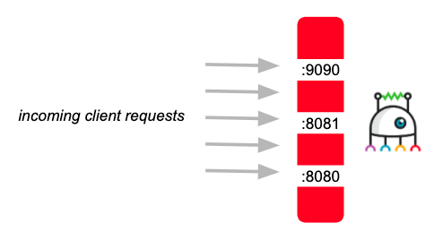

#Couper Documentation - Version 1.2

## Table of Contents

* [Table of Contents](#table-of-contents)
* [Introduction](#introduction)
* [Getting Started](#getting-started)
* [Concepts](#concepts)
    * [Configuration File](#configuration-file)
    * [Language](#language)
    * [File name](#file-name)
    * [Basic file structure](#basic-file-structure)
    * [Expressions](#expressions)
    * [Variables](#variables)
        * [Variable Example](#variable-example)
    * [Functions](#functions)
        * [Functions Examples:](#functions-examples)
* [Configuration examples](#configuration-examples)
    * [Request routing example](#request-routing-example)
    * [Routing configuration example](#routing-configuration-example)
    * [Web serving configuration example](#web-serving-configuration-example)
    * [access_control configuration example](#access_control-configuration-example)
    * [hosts configuration example](#hosts-configuration-example)

## Introduction

Couper is a lightweight open source API gateway designed to support developers in
building and running API-driven Web projects. Acting as a proxy component it connects
clients with (micro) services and adds access control and observability to the project.
Couper does not need any special development skills and offers easy configuration
and integration.

## Getting Started

* [Configuration Reference](REFERENCE.md)

## Concepts


| Concept / Feature  | Description |
|:-------------------|:------------|
| Client(s)          | Browser, App or API Client that sends requests to Couper. |
| Web Serving        | Couper supports file serving and Web serving for SPA assets. |
| API                | Configuration block that bundles endpoints under a certain base path. |
| Access Control     | Couper handles access control for incoming client requests and outgoing backend requests. |
| Endpoint           | Configuration block that specifies how (and if) requests are sent to backend service(s) after they reach Couper. |
| Backend            | Configuration block that specifies the connection to a local/remote backend service. |
| Logging            | Couper provides standard logs for analysis and monitoring. |
| Backend Service(s) | External API or micro services where Couper fetches data from. |
| Validation         | Couper supports validation of outgoing and incoming requests to and from the origin. |

### Configuration File

### Language

The language for Couper's configuration file is [HCL 2.0](https://github.com/hashicorp/hcl/tree/hcl2#information-model-and-syntax), a configuration language by HashiCorp.

### File name

The file-ending of your configuration file should be .hcl to have syntax highlighting
within your IDE.

The file name defaults to `couper.hcl` in your working directory. This can be
changed with the `-f` command-line flag. With `-f /opt/couper/my_conf.hcl` couper
changes the working directory to `/opt/couper` and loads `my_conf.hcl`.

### Basic file structure

Couper's configuration file consists of nested configuration blocks that configure
Web serving and routing of the gateway. Access control is controlled by an
[Access Control](./REFERENCE.md#access-control) attribute that can be set for many blocks.

For orientation compare the following example and the information below:

```hcl
server "my_project" {
  files { 
    # ...
  }

  spa {
    # ...
  }

  api {
    access_control = ["foo"]
    endpoint "/bar" {
      proxy {
        backend { }
      }
      request "sub-request" {
        backend { }
      }
      response { }
    }
  }
}

definitions {
  # ...
}

settings {
  # ...
}
```

* `server` main configuration block(s)
    * `files` configuration block for file serving
    * `spa` configuration block for Web serving (SPA assets)
    * `api` configuration block(s) that bundles endpoints under a certain base path or `access_control` list
    * `access_control` attribute that sets access control for a block context
    * `endpoint` configuration block for Couper's entry points
        * `proxy` configuration block for a proxy request and response to an origin
        * `request` configuration block for a manual request to an origin
        * `response` configuration block for a manual client response
        * `backend` configuration block for connection to local/remote backend service(s)
* `definitions` block for predefined configurations, that can be referenced
* `settings` block for server configuration which applies to the running instance

### Expressions

Since we use HCL2 for our configuration, we are able to use attribute values as
expression:

```hcl
// Arithmetic with literals and application-provided variables
sum = 1 + addend

// String interpolation and templates
message = "Hello, ${name}!"

// Application-provided functions
shouty_message = upper(message)
```

### Variables

The configuration file allows the use of some predefined variables. There are two phases when those variables get evaluated.
The first phase is at config load which is currently related to `env` and simple **function** usage.
The second evaluation will happen during the request/response handling.

* `env` are the environment variables
* `request` is the client request
* `backend_requests` contains all modified backend requests
* `backend_responses` contains all original backend responses

#### Variable Example

An example to send an additional header with client request header to a configured
backend and gets evaluated on per-request basis:

```hcl
server "variables-srv" {
  endpoint "/" {
    proxy {
      backend "my_backend_definition" {
        set_request_headers = {
          x-env-user = env.USER
          user-agent = "myproxyClient/${request.headers.app-version}"
          x-uuid = request.id
        }
      }
    }
  }
}
```

See [variables reference](./REFERENCE.md#variables).

### Functions

Functions are little helper methods which are registered for every hcl evaluation
context.

See [functions reference](./REFERENCE.md#functions).

#### Functions Examples

```hcl
my_attribute = base64_decode("aGVsbG8gd29ybGQK")

iat = unixtime()

my_json = json_encode({
  value-a: backend_responses.default.json_body.origin
  value-b: ["item1", "item2"]
})

x = merge({"k1": 1}, null, {"k2": 2})          // -> {"k1": 1, "k2": 2}        merge object attributes
x = merge({"k": [1]}, {"k": [2]})              // -> {"k": [1, 2]}             merge tuple values
x = merge({"k": {"k1": 1}}, {"k": {"k2": 2}})  // -> {"k": {"k1": 1, "k2": 2}} merge object attributes
x = merge({"k": [1]}, {"k": null}, {"k": [2]}) // -> {"k": [2]}                remove value and set new value
x = merge({"k": [1]}, {"k": 2})                // -> {"k": 2}                  set new value
x = merge([1], null, [2, "3"], [true, false])  // -> [1, 2, "3", true, false]  merge tuple values

x = merge({"k1": 1}, 2)                        // -> error: cannot mix object with primitive value
x = merge({"k1": 1}, [2])                      // -> error: cannot mix object with tuple
x = merge([1], 2)                              // -> error: cannot mix tuple with primitive value

token = jwt_sign("MyJwt", {"sub": "abc12345"})

url = saml_sso_url("MySaml")

definitions {
  jwt_signing_profile "MyJwt" {
    signature_algorithm = "RS256"
    key_file = "priv_key.pem"
    ttl = "1h"
    claims = {
      iss = "The_Issuer"
    }
  }
  saml "MySaml" {
    idp_metadata_file = "idp-metadata.xml"
    sp_acs_url = "https://the-sp.com/api/saml/acs"
    sp_entity_id = "the-sp-entity-id"
    array_attributes = ["memberOf"]
  }
}
```

## Configuration examples

See the official Couper's examples and tutorials
[repository](https://github.com/avenga/couper-examples), too.

### Request routing example


| No. | Configuration source                              |
|:----|:--------------------------------------------------|
| 1   | `hosts` attribute in `server` block               |
| 2   | `base_path` attribute in `api` block              |
| 3   | *label* of `endpoint` block                       |
| 4   | `origin` attribute in `backend` block             |
| 5   | `path_prefix` attribute in `backend`              |
| 6   | `path` attribute in `endpoint` or `backend` block |

### Routing configuration example

```hcl
api "my_api" {
  base_path = "/api/novoconnect"

  endpoint "/login/**" {
    # incoming request: .../login/foo
    # implicit proxy
    # outgoing request: http://identityprovider:8080/login/foo
    proxy {
      backend {
        origin = "http://identityprovider:8080"
      }
    }
  }

  endpoint "/cart/**" {
      # incoming request: .../cart/items
      # outgoing request: http://cartservice:8080/api/v1/items
      path = "/api/v1/**"
      proxy {
        backend {
          origin = "http://cartservice:8080"
        }
      }

      endpoint "/account/{id}" {
        # incoming request: .../account/brenda
        # outgoing request: http://accountservice:8080/user/brenda/info
        proxy {
          backend {
            path = "/user/${request.param.id}/info"
            origin = "http://accountservice:8080"
          }
        }
      }
    }
  }
```

### Web serving configuration example

```hcl
server "my_project" {
  files {
    document_root = "./htdocs"
    error_file = "./my_custom_error_page.html"
  }

  spa {
    bootstrap_file = "./htdocs/index.html"
    paths = [
      "/app/**",
      "/profile/**"
    ]
  }
}
```

### `access_control` configuration example

```hcl
server "ac-example" {
  access_control = ["ac1"]
  files {
    access_control = ["ac2"]
  }

  spa {
    bootstrap_file = "myapp.html"
  }

  api {
    access_control = ["ac3"]
    endpoint "/foo" {
      disable_access_control = ["ac3"]
    }
    endpoint "/bar" {
      access_control = ["ac4"]
    }
  }
}

definitions {
  basic_auth "ac1" { }
  jwt "ac2" { }
  jwt "ac3" { }
  jwt "ac4" { }
}
```

The following table shows which `access_control` is set for which context:

| context          | `ac1` | `ac2` | `ac3` | `ac4` |
|------------------|:-----:|:-----:|:-----:|:-----:|
| `files`          | x     | x     |       |       |
| `spa`            | x     |       |       |       |
| `endpoint "foo"` | x     |       |       |       |
| `endpoint "bar"` | x     |       | x     | x     |

### `hosts` configuration example

Example configuration: `hosts = [ "localhost:9090", "api-stage.wao.io", "api.wao.io", "*:8081" ]`

The example configuration above makes Couper listen to port `:9090`, `:8081` and `8080`.



In a second step Couper compares the host-header information with the configuration.
In case of mismatch a system error occurs (HTML error, status 500).
